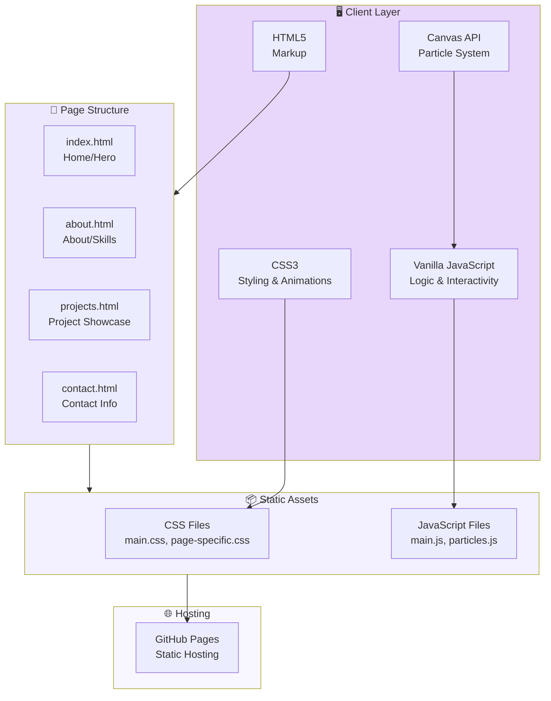
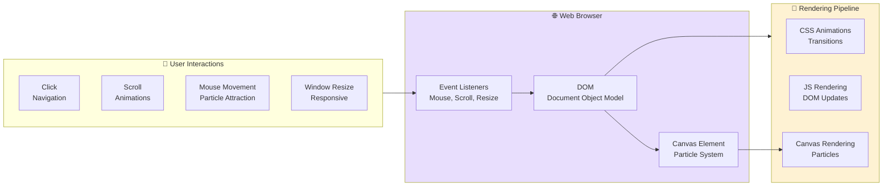
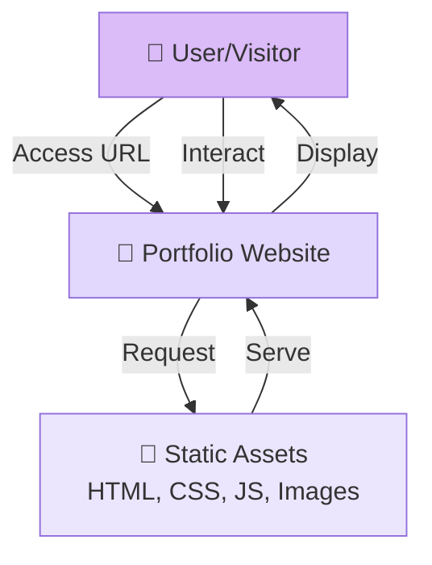
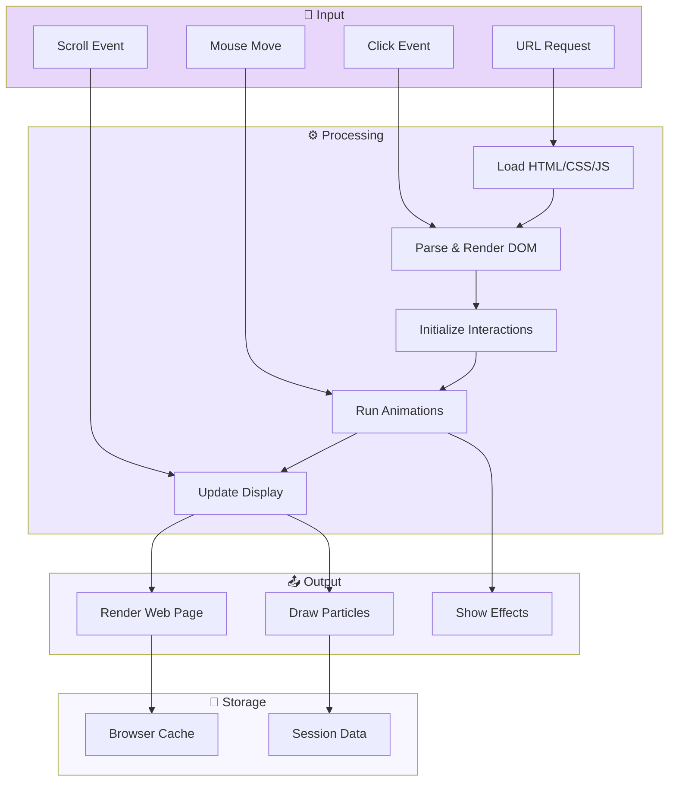
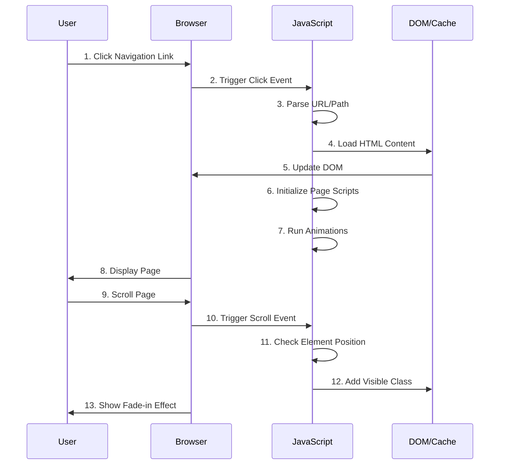
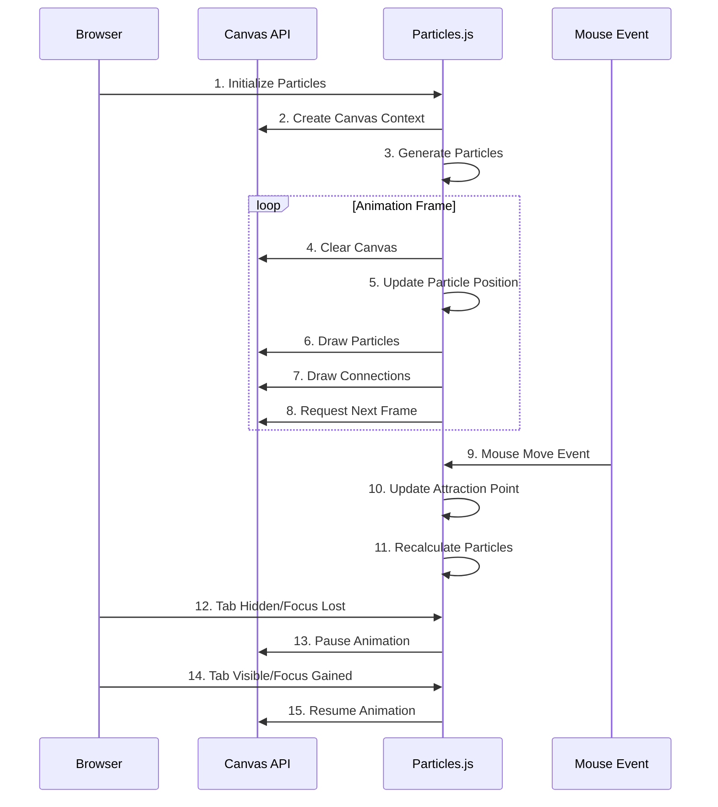

<div align="center">

# Ficram Manifur - Portfolio Website

**Modern, Elegant, and Interactive Personal Portfolio**

[](https://github.com/ficrammanifur/portfolio)
[](https://developer.mozilla.org/)
[](https://developer.mozilla.org/en-US/docs/Web/JavaScript)
[](https://pages.github.com/)
[](LICENSE)
[](https://github.com/ficrammanifur/portfolio)

*Responsive portfolio website showcasing projects, skills, and expertise with animated particle background and interactive features*

**Electrical Engineering Student | Embedded Systems & AI Enthusiast | IoT Developer**

**Live Website**  
https://ficrammanifur.github.io/Portfolio-Ficrammanifur/

</div>

---

## 📑 Daftar Isi (Table of Contents)

- [✨ Features](#-features)
- [🧩 Komponen Utama](#-komponen-utama)
- [🏗️ Arsitektur Sistem](#-arsitektur-sistem)
- [📊 Data Flow Diagram (DFD)](#-data-flow-diagram-dfd)
- [📈 Entity Relationship (ER) Structure](#-entity-relationship-er-structure)
- [🔄 Alur Kerja Sistem](#-alur-kerja-sistem)
- [📁 Struktur Project](#-struktur-project)
- [🚀 Quick Start](#-quick-start)
- [🔧 Konfigurasi](#-konfigurasi)
- [⚙️ Optimasi & Performance](#️-optimasi--performance)
- [🎯 Roadmap](#-roadmap)
- [📄 License](#-license)

---

## ✨ Features

- **🎨 Modern Design** - Dark theme dengan ungu/violet sebagai primary color
- **✨ Animated Particle Background** - Network-style particles dengan mouse interaction (hero section only)
- **⚡ Performance Optimized** - FPS dibatasi 30, mobile detection, prefers-reduced-motion support
- **📱 Fully Responsive** - Desktop, tablet, dan mobile-optimized
- **🎭 Interactive Elements** - Typing animation, smooth scroll, fade-in effects
- **♿ Accessibility First** - Semantic HTML, ARIA labels, keyboard navigation
- **🌐 Multi-page Structure** - Home, About, Projects, Contact pages
- **🚀 GitHub Pages Ready** - Deploy langsung tanpa framework atau build tools
- **💻 No Dependencies** - Pure HTML, CSS, dan vanilla JavaScript

---

## 🧩 Komponen Utama

| Component | Technology | Purpose | Status |
|-----------|-----------|---------|--------|
| **Frontend** | HTML5, CSS3, Vanilla JS | User interface & interactions | ✅ Active |
| **Particle System** | Canvas API | Animated background effects | ✅ Active |
| **Navigation** | JavaScript DOM | Multi-page navigation & menu | ✅ Active |
| **Animations** | CSS Transitions + JS | Smooth transitions & effects | ✅ Active |
| **Hosting** | GitHub Pages | Static site deployment | ✅ Active |

---

## 🏗️ Arsitektur Sistem

### Diagram Blok Sistem



### Komponen Interaksi



---

## 📊 Data Flow Diagram (DFD)

### Level 0 - Sistem Keseluruhan



### Level 1 - Proses Detail



### Alur Page Navigation



### Alur Particle Animation



---

## 📈 Entity Relationship (ER) Structure

Catatan: Sebagai static website, portfolio tidak menggunakan database. Namun, berikut adalah struktur data logis yang digunakan:

### Data Structure Model

```
Portfolio
├── User Profile
│   ├── Name: "Ficram Manifur"
│   ├── Title: "Electrical Engineering Student"
│   ├── Location: "Tangerang, Indonesia"
│   ├── Bio: "Embedded Systems & AI Enthusiast"
│   └── Social Links
│       ├── GitHub
│       ├── LinkedIn
│       ├── Email
│       └── Spotify
│
├── Skills
│   ├── Technical Skills
│   │   ├── Category: "Embedded Systems"
│   │   ├── Category: "AI & Machine Learning"
│   │   ├── Category: "IoT Development"
│   │   └── Category: "Web Development"
│   │
│   └── Soft Skills
│       ├── Problem Solving
│       ├── Communication
│       ├── Leadership
│       └── Teamwork
│
├── Projects
│   ├── Project[id]
│   │   ├── Title
│   │   ├── Description
│   │   ├── Technologies
│   │   ├── Live Demo URL
│   │   ├── GitHub URL
│   │   ├── Image/Screenshot
│   │   └── Status (Completed/Ongoing)
│   │
│   └── Project[id+1]
│       └── ...
│
└── Contact Information
    ├── Email
    ├── Phone
    ├── Social Media
    └── Contact Form Data (optional)
```

### Struktur File Relationship

```
index.html (Hero/Home)
├── Header Section
│   ├── Navigation Menu
│   │   ├── Home (active)
│   │   ├── About
│   │   ├── Projects
│   │   └── Contact
│   └── Mobile Menu
│
├── Hero Section
│   ├── Title
│   ├── Animated Typing Text
│   ├── Particle Background (Canvas)
│   └── CTA Buttons
│
└── Featured Content
    └── Latest Projects Preview

about.html (Skills/Expertise)
├── Header (Navigation)
├── About Section
│   ├── Bio Text
│   ├── Expertise Areas
│   └── Achievement Timeline
│
└── Skills Section
    ├── Technical Skills Grid
    ├── Tools & Technologies
    └── Interests & Hobbies

projects.html (Project Showcase)
├── Header (Navigation)
├── Projects Grid
│   ├── Project Card[1]
│   │   ├── Image
│   │   ├── Title
│   │   ├── Description
│   │   ├── Tech Stack
│   │   ├── Live Demo Link
│   │   └── GitHub Link
│   │
│   └── Project Card[n]
│       └── ...
│
└── Filters (optional)
    ├── By Category
    └── By Technology

contact.html (Get in Touch)
├── Header (Navigation)
├── Contact Information
│   ├── Email
│   ├── Phone
│   └── Location
│
├── Contact Form (optional)
│   ├── Name Input
│   ├── Email Input
│   ├── Message Textarea
│   └── Submit Button
│
└── Social Links
    ├── GitHub
    ├── LinkedIn
    ├── Twitter
    └── Spotify Now Playing
```

---

## 🔄 Alur Kerja Sistem

### 1. Inisialisasi Website

```
[Browser Load]
    ↓
[Parse HTML]
    ↓
[Load & Parse CSS]
    ↓
[Load & Execute JavaScript]
    ↓
[Initialize Particle System on Canvas]
    ↓
[Initialize Event Listeners]
    ↓
[Render Page to User]
    ↓
[Ready for Interaction]
```

### 2. Page Navigation Flow

```
[User Clicks Navigation Link]
    ↓
[JavaScript Intercepts Click]
    ↓
[Parse Target Page URL]
    ↓
[Hide Current Page (Fade Out)]
    ↓
[Load New Page Content]
    ↓
[Parse & Insert HTML]
    ↓
[Re-initialize Scripts for New Page]
    ↓
[Show New Page (Fade In)]
    ↓
[Update Active Navigation Link]
```

### 3. Particle Animation Flow

```
[Canvas Initialized]
    ↓
[Generate Random Particles]
    ↓
[Set FPS to 30]
    ↓
[Request Animation Frame]
    ↓
[Update Particle Positions]
    ↓
[Calculate Connections (if within distance)]
    ↓
[Draw Particles & Lines]
    ↓
[Mouse Move? → Update Attraction]
    ↓
[Check Tab Visibility]
    ↓
[Request Next Frame or Pause]
```

### 4. Scroll Animation Flow

```
[User Scrolls Page]
    ↓
[Intersection Observer Detects Element]
    ↓
[Check if Element is Visible]
    ↓
[Add 'Visible' Class to Element]
    ↓
[CSS Animation Triggers]
    ↓
[Fade-in Effect Displays]
    ↓
[Element Stays Visible]
```

---

## 📁 Struktur Project

```
portfolio/
├── 📄 index.html                 # Home page dengan hero section
├── 📄 about.html                 # About page dengan skills
├── 📄 projects.html              # Projects showcase page
├── 📄 contact.html               # Contact information page
│
├── 📁 css/
│   ├── 🎨 main.css              # Global styles & animations
│   ├── 🎨 about.css             # About page specific styles
│   ├── 🎨 projects.css          # Projects page specific styles
│   └── 🎨 contact.css           # Contact page specific styles
│
├── 📁 js/
│   ├── ⚙️ main.js               # Main script (navigation, scroll animations)
│   └── ⚙️ particles.js          # Particle system (canvas animation)
│
├── 📁 images/ (optional)
│   ├── project-screenshots/
│   └── icons/
│
├── 📝 README.md                  # Project documentation
├── 📝 DEPLOYMENT.md              # Deployment guide
└── 📝 LICENSE                    # MIT License
```

### File Dependencies

```
index.html
├── <link> → css/main.css
├── <link> → css/main.css (hero specific)
├── <script> → js/main.js
└── <script> → js/particles.js

about.html
├── <link> → css/main.css
├── <link> → css/about.css
└── <script> → js/main.js

projects.html
├── <link> → css/main.css
├── <link> → css/projects.css
└── <script> → js/main.js

contact.html
├── <link> → css/main.css
├── <link> → css/contact.css
└── <script> → js/main.js
```

---

## 🚀 Quick Start

### 1. Clone Repository
```bash
git clone https://github.com/ficrammanifur/Portfolio-Ficrammanifur.git
cd portfolio
```

### 2. Local Testing (Optional)
Gunakan live server untuk testing lokal:
```bash
# Menggunakan Python 3
python -m http.server 8000

# atau menggunakan Node.js http-server
npx http-server

# Buka di browser: http://localhost:8000
```

### 3. Customize Content
Edit file HTML sesuai kebutuhan:
- **index.html**: Update hero title, description, dan CTA
- **about.html**: Update bio, skills, dan expertise
- **projects.html**: Tambah/edit project cards
- **contact.html**: Update contact information

### 4. Customize Styling
Modifikasi CSS variables di `css/main.css`:
```css
:root {
  --color-primary: #9333ea;
  --color-secondary: #7c3aed;
  --color-accent: #a78bfa;
  --color-bg: #0f172a;
  --color-text: #e2e8f0;
}
```

### 5. Deploy ke GitHub Pages

```bash
# 1. Push ke GitHub
git add .
git commit -m "Initial portfolio commit"
git push origin main

# 2. Go to Settings → Pages
# 3. Select main branch dan /root folder
# 4. GitHub automatically deploys

# URL: https://yourusername.github.io/portfolio/
```

---

## 🔧 Konfigurasi

### Color Configuration (css/main.css)

```css
:root {
  /* Primary Colors */
  --color-primary: #9333ea;      /* Violet */
  --color-secondary: #7c3aed;    /* Darker Violet */
  --color-accent: #a78bfa;       /* Light Violet */
  
  /* Background & Text */
  --color-bg: #0f172a;           /* Very Dark Blue */
  --color-bg-light: #1e293b;     /* Dark Blue */
  --color-text: #e2e8f0;         /* Light Gray */
  --color-text-muted: #94a3b8;   /* Muted Gray */
  
  /* Borders & Lines */
  --color-border: #334155;       /* Gray Border */
  --color-border-light: #475569; /* Light Border */
}
```

### Particle Configuration (js/particles.js)

```javascript
// Particle System Settings
const config = {
  particleCount: 50,              // Number of particles
  connectionDistance: 150,        // Lines drawn if < this distance
  maxVelocity: 2,                 // Maximum speed
  mouseAttractionRange: 150,      // Attraction radius from mouse
  fps: 30,                        // Frame rate limit
  particleColor: 'rgba(147, 51, 234, 0.6)',  // RGBA color
};
```

### Animation Timing (css/main.css)

```css
/* Global Animation Speeds */
--transition-fast: 200ms;
--transition-normal: 400ms;
--transition-slow: 600ms;
--ease-in-out: cubic-bezier(0.4, 0, 0.2, 1);
```

---

## ⚙️ Optimasi & Performance

### Performance Metrics

| Metric | Value | Status |
|--------|-------|--------|
| **Page Load Time** | < 1s | ✅ Excellent |
| **First Contentful Paint** | < 500ms | ✅ Excellent |
| **Largest Contentful Paint** | < 1.5s | ✅ Good |
| **Cumulative Layout Shift** | < 0.1 | ✅ Good |
| **Lighthouse Score** | 95+ | ✅ Excellent |

### Optimasi yang Diterapkan

1. **JavaScript Optimization**
   - Pure vanilla JavaScript (no dependencies)
   - Efficient event delegation
   - Intersection Observer for lazy animations
   - Requestanimationframe untuk smooth 30 FPS

2. **CSS Optimization**
   - Minimal CSS selectors
   - Hardware-accelerated transforms
   - Efficient media queries
   - CSS variables untuk theme management

3. **Asset Optimization**
   - Inline critical CSS
   - Async JavaScript loading
   - Image compression (if used)
   - Gzip compression by GitHub Pages

4. **Mobile Optimization**
   - Disable particles on mobile
   - Responsive font sizes
   - Touch-friendly clickable elements
   - Optimized mobile navigation

5. **Accessibility Features**
   - Respects `prefers-reduced-motion`
   - Keyboard navigation support
   - Semantic HTML structure
   - ARIA labels untuk assistive technology

---

## 🎯 Roadmap

### Version 1.0 (Current)
- [x] Multi-page static website
- [x] Animated particle background
- [x] Responsive design
- [x] Dark theme styling
- [x] Interactive navigation
- [x] Performance optimized

### Version 1.1 (Planned)
- [ ] Light/Dark theme toggle
- [ ] Blog section dengan static posts
- [ ] Project filtering by technology
- [ ] Contact form dengan email integration
- [ ] Enhanced mobile navigation

### Version 2.0 (Future)
- [ ] CMS integration (Sanity, Contentful)
- [ ] Dynamic project loading
- [ ] Comments section
- [ ] Newsletter subscription
- [ ] Analytics tracking
- [ ] Multi-language support

---

## 📊 Browser Compatibility

| Browser | Version | Support | Note |
|---------|---------|---------|------|
| **Chrome** | Latest | ✅ Full | Recommended |
| **Firefox** | Latest | ✅ Full | Excellent |
| **Safari** | Latest | ✅ Full | iOS & macOS |
| **Edge** | Latest | ✅ Full | Chromium-based |
| **Mobile Chrome** | Latest | ✅ Full | Particles disabled |
| **Mobile Safari** | Latest | ✅ Full | Particles disabled |

---

## 🔧 Troubleshooting

### Particles Not Showing
- Check browser console untuk errors
- Verify Canvas API support di browser
- Check `prefers-reduced-motion` setting
- Verify particles.js di-load dengan benar

### Responsive Issues
- Clear browser cache (Ctrl+Shift+Del)
- Test di different screen sizes
- Check media queries di CSS
- Verify viewport meta tag di HTML

### Navigation Not Working
- Check JavaScript errors di console
- Verify file paths di navigation links
- Ensure HTML files exist di directory
- Check click event listeners

### Performance Issues
- Reduce `particleCount` di particles.js
- Check untuk large images
- Disable browser extensions
- Test di incognito/private mode

### GitHub Pages Deployment
- Verify repository name di Settings
- Check branch selection (main/master)
- Clear GitHub Pages cache (5-10 minutes)
- Verify custom domain (if used) di DNS

---

## 📚 Additional Resources

- [MDN Web Docs](https://developer.mozilla.org/) - HTML, CSS, JavaScript reference
- [GitHub Pages Documentation](https://docs.github.com/en/pages)
- [Canvas API Guide](https://developer.mozilla.org/en-US/docs/Web/API/Canvas_API)
- [Intersection Observer API](https://developer.mozilla.org/en-US/docs/Web/API/Intersection_Observer_API)
- [Web Performance](https://web.dev/performance/)

---

## 📄 License

This portfolio website is open source and available under the MIT License.

See [LICENSE](LICENSE) file for complete license text.

---

## 👨‍💻 Author

**Ficram Manifur**
- 📧 Email: ficrammanifur@gmail.com
- 🐙 GitHub: [@ficrammanifur](https://github.com/ficrammanifur)
- 💼 LinkedIn: [Ficram Manifur](https://linkedin.com/in/ficrammanifur)
- 🎵 Spotify: [Ficram's Playlists](https://open.spotify.com/user/ficrammanifur)

**📍 Tangerang, Indonesia** | **🗓️ January 2026**

---

<div align="center">

**⭐ If you find this portfolio useful, please give it a star!**

Made with ❤️ using pure HTML, CSS, and JavaScript

</div>
